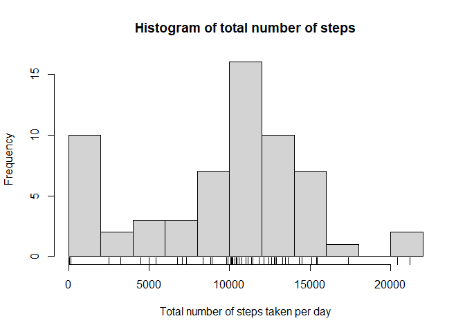
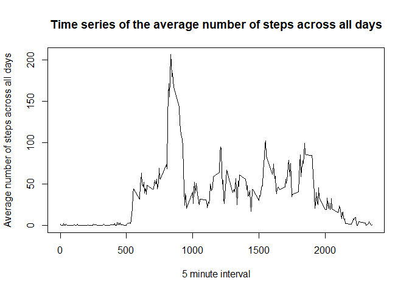
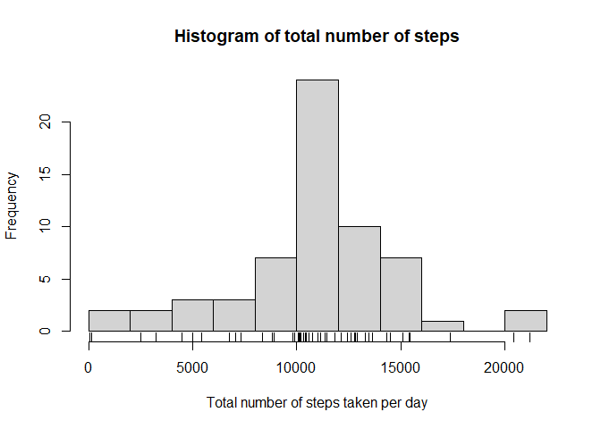
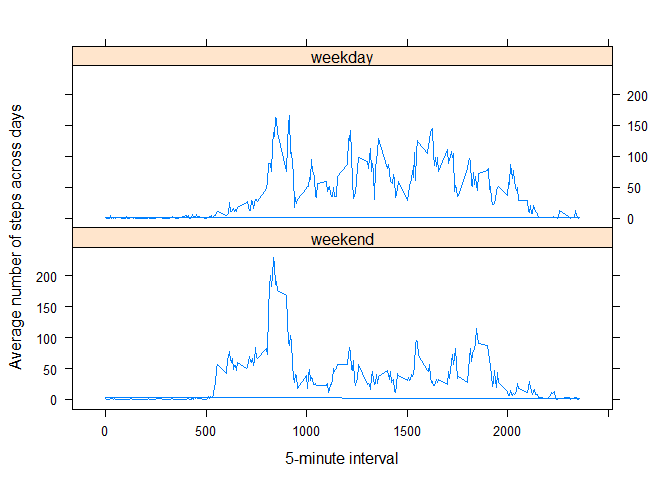

## Loading and preprocessing the data


```r
library(readr)
activity <- read_csv("activity.csv", col_types = cols(steps = col_number(), 
    date = col_datetime(format = "%Y-%m-%d"), 
    interval = col_number()),na = "NA")
print(activity[1:4,])
```

```
## # A tibble: 4 x 3
##   steps date                interval
##   <dbl> <dttm>                 <dbl>
## 1    NA 2012-10-01 00:00:00        0
## 2    NA 2012-10-01 00:00:00        5
## 3    NA 2012-10-01 00:00:00       10
## 4    NA 2012-10-01 00:00:00       15
```

## What is mean total number of steps taken per day?


```r
NstepsBYDay<-tapply(activity$steps,activity$date,sum,na.rm=T)
hist(NstepsBYDay,breaks = 10,xlab = "Total number of steps taken per day", main = "Histogram of total number of steps")
rug(NstepsBYDay)
```

<!-- -->

```r
Smean<-mean(NstepsBYDay)
Smedian<-median(NstepsBYDay)
```

The mean of the steps taken per day is 9354.2 while the median is 10395.0

## What is the average daily activity pattern?


```r
NstepsBYinterval<-tapply(activity$steps,activity$interval,mean,na.rm=T)
plot(names(NstepsBYinterval),NstepsBYinterval,type = "l",xlab = "5 minute interval", ylab = "Average number of steps across all days",main = "Time series of the average number of steps across all days")
```

<!-- -->

```r
IdxMaxNstepsBYinterval<-which.max(NstepsBYinterval)
```

The 5-minute interval with the maximun number of steps across all the days is:835-840

## Imputing missing values


```r
NumNA<-sum(is.na(activity$steps))
```

The number of nan's is: 2304.\
The nan's values will be fill with the mean for the 5-minute interval


```r
Idx<-is.na(activity$steps)
activityWithoutNA<-activity
AVG5min<-ave(activityWithoutNA$steps,activityWithoutNA$interval,FUN = function(x) mean(x, na.rm = TRUE))
activityWithoutNA$steps[Idx]<-AVG5min[Idx]
print(activityWithoutNA[1:4,])
```

```
## # A tibble: 4 x 3
##   steps date                interval
##   <dbl> <dttm>                 <dbl>
## 1 1.72  2012-10-01 00:00:00        0
## 2 0.340 2012-10-01 00:00:00        5
## 3 0.132 2012-10-01 00:00:00       10
## 4 0.151 2012-10-01 00:00:00       15
```


```r
NstepsBYDay<-tapply(activityWithoutNA$steps,activityWithoutNA$date,sum,na.rm=T)
hist(NstepsBYDay,breaks = 10,xlab = "Total number of steps taken per day", main = "Histogram of total number of steps")
rug(NstepsBYDay)
```

<!-- -->

```r
Smean<-mean(NstepsBYDay)
Smedian<-median(NstepsBYDay)
```
After filling the missing values (NA) the mean of the steps taken per day is 10766.2 while the median is 10766.2. Now, the distribution of the total number of steps per day is much less skew.


## Are there differences in activity patterns between weekdays and weekends?


```r
activityWithoutNA$weekday <-factor((weekdays(activityWithoutNA$date)=="Saturday" | weekdays(activityWithoutNA$date) == "Sunday"),levels=c(FALSE,TRUE),labels=c("weekend","weekday"))


activityWithoutNA$avg_by_interval_and_weekday<-ave(activityWithoutNA$steps,activityWithoutNA$interval,activityWithoutNA$weekday,FUN = function(x) mean(x, na.rm = TRUE))

library(lattice)
xyplot(avg_by_interval_and_weekday~interval|weekday,data=activityWithoutNA,layout=c(1,2),type ="l",xlab = "5-minute interval",ylab = "Average number of steps across days")
```

<!-- -->

During the weekends the activity is more intense around the 835-840 5-minutes interval, while, during weekdays, the activity is more uniform distributed along the day.


